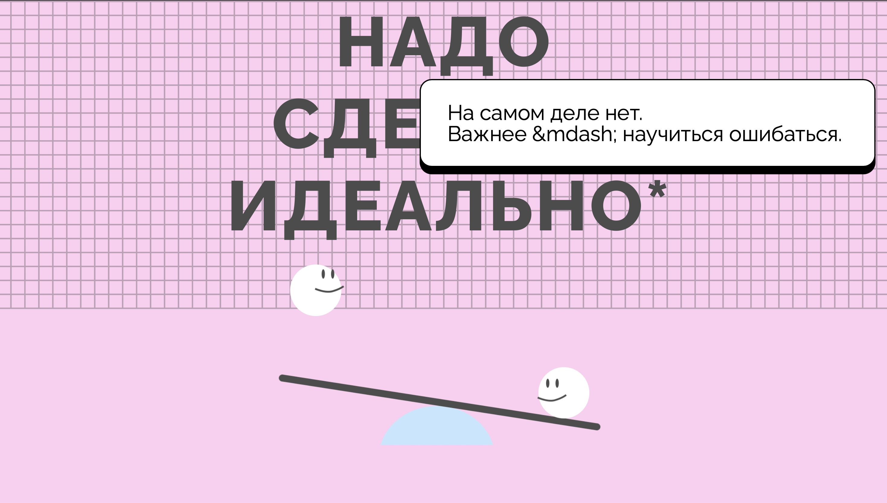

https://github.com/Ibrashka07/nado_sdelat_idealno

# Проект "Надо сделать идеально"

## Скриншот

## Скриншот с тултипом

## Макет 

- Макет задания: [Figma](https://www.figma.com/design/8oKbCdYbLgfDehpQNJEoMS/-3-Надо-сделать-идеально?node-id=0-1&p=f&t=A7RVG25ovzgiLkSn-0)

## Благодарность

Благодарю команду Яндекс Практикум за предоставление дизайна и уроков!